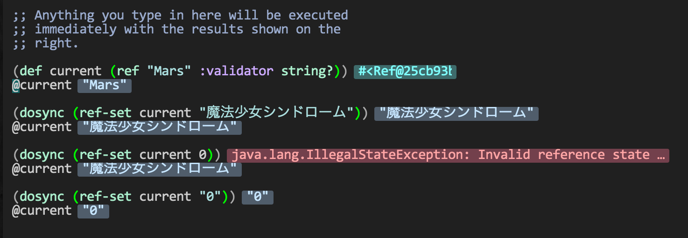
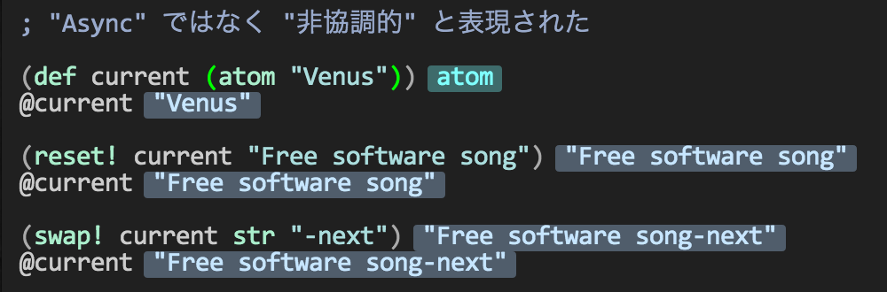
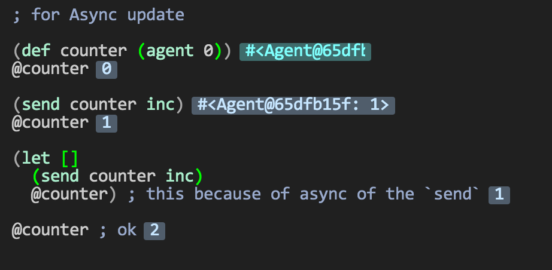
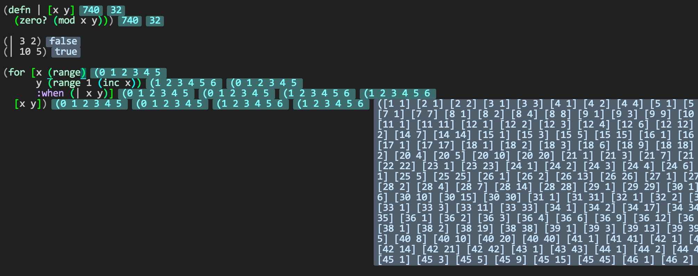
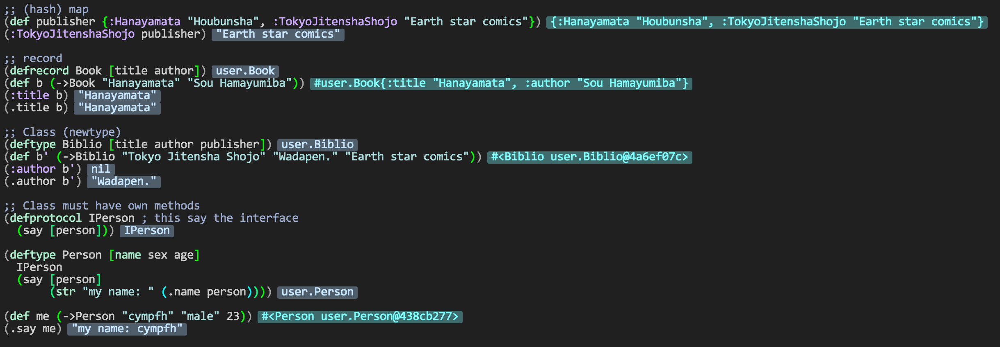

2014年 9月15日 月曜日 23時51分41秒 JST
===

Clojure with LightBox, REPL editor.  
partially practical i think.

### three kinds of refference var

### infinitely sequence by `for`

too noisy...

### map, record and class

ugly class
