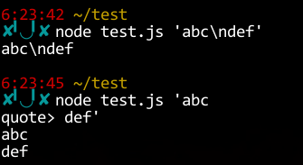

2014年 10月 11日 土曜日 06:24:54 JST
===

twurlってゆー、Rubyで書かれたCLIのTwitterクライアント
があって、
それが改行を含む投稿ができなくて困ってた．
具体的には "\n" を "\\n"

```javascript
// コマンドライン引数一個目をそのまま吐く
console.log(process.argv[2]);
```



どちらも、２つ目のような結果になるものだと、
勘違いしてた．
